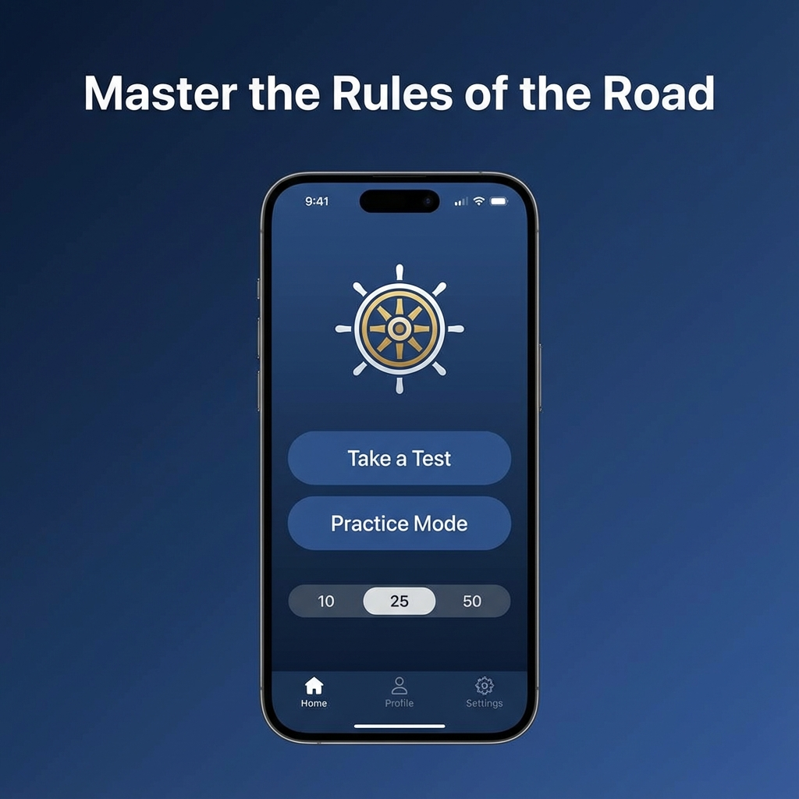
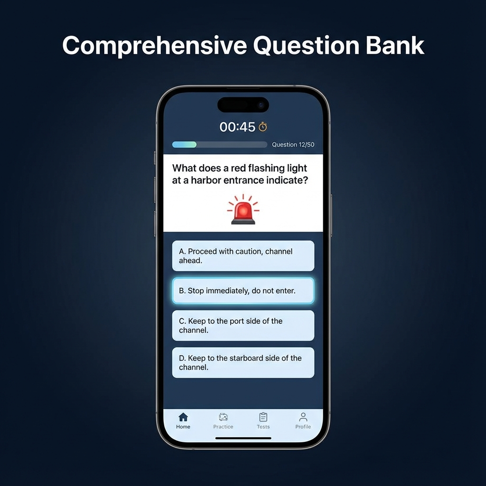
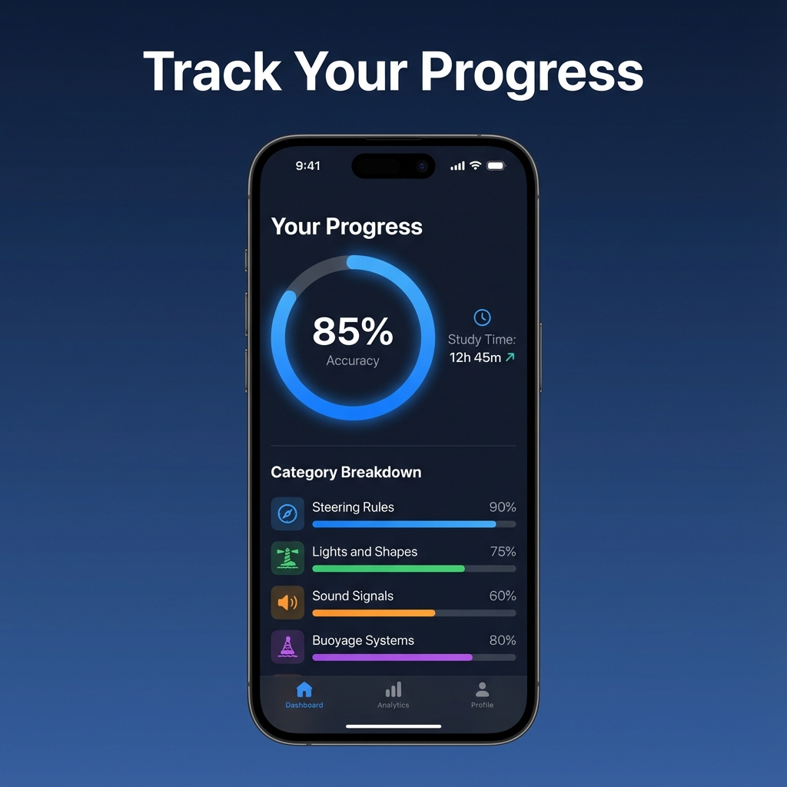

# 🚢 Nautical Rules

A comprehensive iOS quiz app for mastering USCG Navigation Rules (Rules of the Road). Perfect for boaters, sailors, and maritime professionals preparing for licensing exams.


## Features

### 📝 Multiple Study Modes
- **Quick Quiz** — Customize with 10, 25, or 50 questions
- **Simulated Exam** — Timed, exam-like conditions
- **Practice by Category** — Focus on specific topics

### 📊 Smart Progress Tracking
- Overall accuracy and study time tracking
- Category-by-category breakdown
- Test history with detailed review
- Identify and strengthen weak areas

### 🔖 Study Tools
- Bookmark difficult questions for later review
- Detailed explanations for every answer
- Visual diagrams for complex scenarios
- Review incorrect answers to learn from mistakes
- Export results as PDF

### 🔒 Privacy Focused
- No account required
- No data collection
- Works completely offline
- All progress stored locally on device

## Screenshots

<p align="center">
  
  
  
</p>

## Requirements

- iOS 17.0+
- Xcode 15.0+
- Swift 5.0+

## Installation

1. Clone the repository:
```bash
git clone https://github.com/iamjoeyjkim/NauticalRules.git
```

2. Open `NauticalRules.xcodeproj` in Xcode

3. Build and run on simulator or device

## Project Structure

```
NauticalRules/
├── Sources/
│   ├── App/              # App entry point
│   ├── Core/Design/      # Theme and styling
│   ├── Models/           # Data models
│   ├── Services/         # Business logic
│   ├── ViewModels/       # View models (MVVM)
│   └── Views/            # SwiftUI views
├── Resources/
│   ├── Assets.xcassets/  # Images and icons
│   ├── Diagrams/         # Question diagrams (SVG)
│   └── *.csv             # Question bank
└── AppStore/             # App Store submission materials
```

## Topics Covered

- Steering and Sailing Rules
- Lights and Shapes
- Sound and Light Signals
- Conduct of Vessels in Sight
- Conduct in Restricted Visibility
- General Rules (Application, Definitions)
- And more...

## Contributing

Contributions are welcome! Please feel free to submit a Pull Request.

## Privacy Policy

[View Privacy Policy](https://iamjoeyjkim.github.io/NauticalRules/privacy.html)

## License

This project is available under the MIT License. See the LICENSE file for more info.

## Author

Created by Joey Kim

---

*Master the Rules of the Road and navigate your way to exam success!* ⚓
